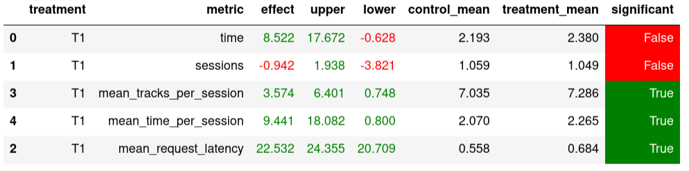

# Отчет

### Основная идея
Сделать ансамбль из пройденных моделей (может быть потюнить некоторые) и добавить всякие хитрости для достижения статистически значимого улучшения.

### Детали
Я сравнивал только свою новую модель и лучшую с пятого семинара.

Итоговая модель это ансамбль `Contextual` нейросетевого рекоммендера (base) и `Contextual` с разнообразными рекомендациями (fallback).
Нейросетевую модель подтюнил изменив пропорцию train/test/val и увеличив количество эпох. Новый файл с рекомендациями грузил в новый редис и оттуда подгружал в программе и передавал в мой рекоммендер `NewWay`. Уже этот ансамбль показывал улучшения, но они были не статистически значимые.

Дальше в ход пошли хитрости: внимательно послушав последнюю практику узнал, что рекоммендер штрафуют за одинаковые треки (сразу в ноль) и за одинаковых исполнителей (экспоненциально). Тогда я добавил в сам рекоммендер проверку на то, что он рекомендует: сначала завел сеты и всегда рекоммендовал новое (но это работало хуже чем control). Однако хэш-таблицы с пороговым значением спасли ситуацию! То есть, один раз я разрешил рекоммендеру повторяться, но если хочет второй, то нужно менять трек. Это дало стат значимый прирост к метрике `mean_time_per_session`. (Запускал single на 1000 итераций в один день)

В целом было еще куча идей как можно улучшить рекоммендер: 
- Использовать время, которое пользователь прослушал предыдущий трэк, чтобы рекомендовать следующий
  - Если не понравился, то рекомендовать похожие смысла мало. Лучше бы взять из TopPop например
  - Если понравился, то наоборот
- Ставить треки от исполнителей которые уже были с некоторой вероятностью (то есть не всегда проверять хэш-таблицу)

Но, так как статистически значимые улучшения и так уже получены, то проверять их я не стал :)

### Результаты

### Инструкция по запуску
Запускать как обычно мы делали на семинарах